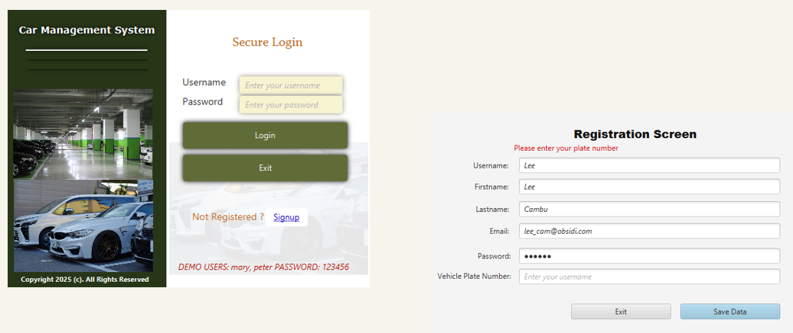
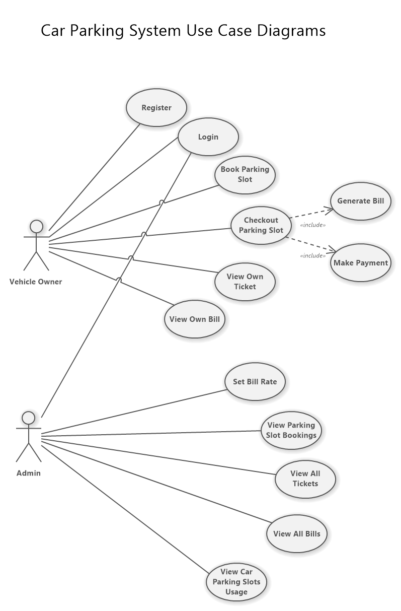
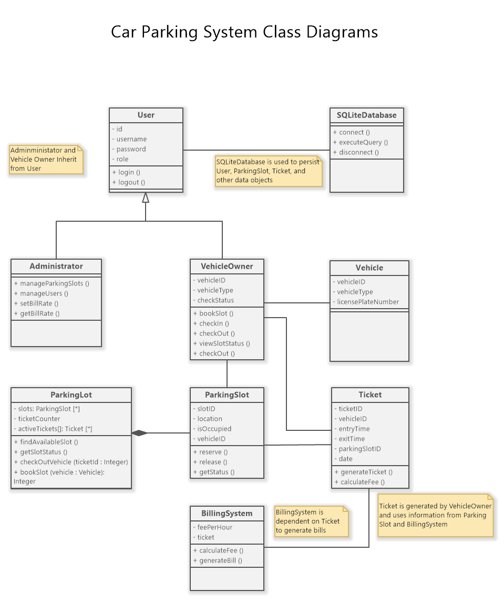
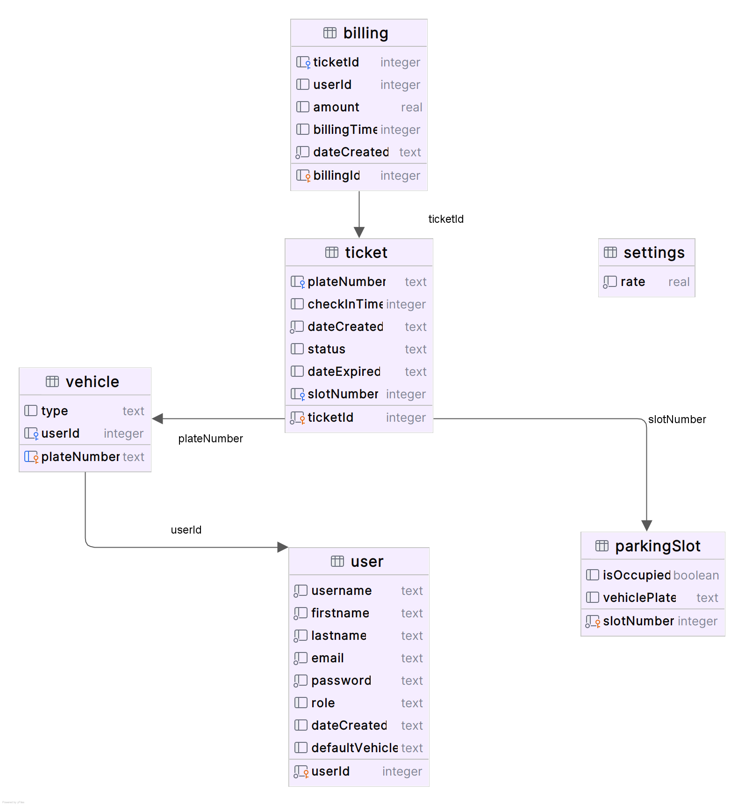
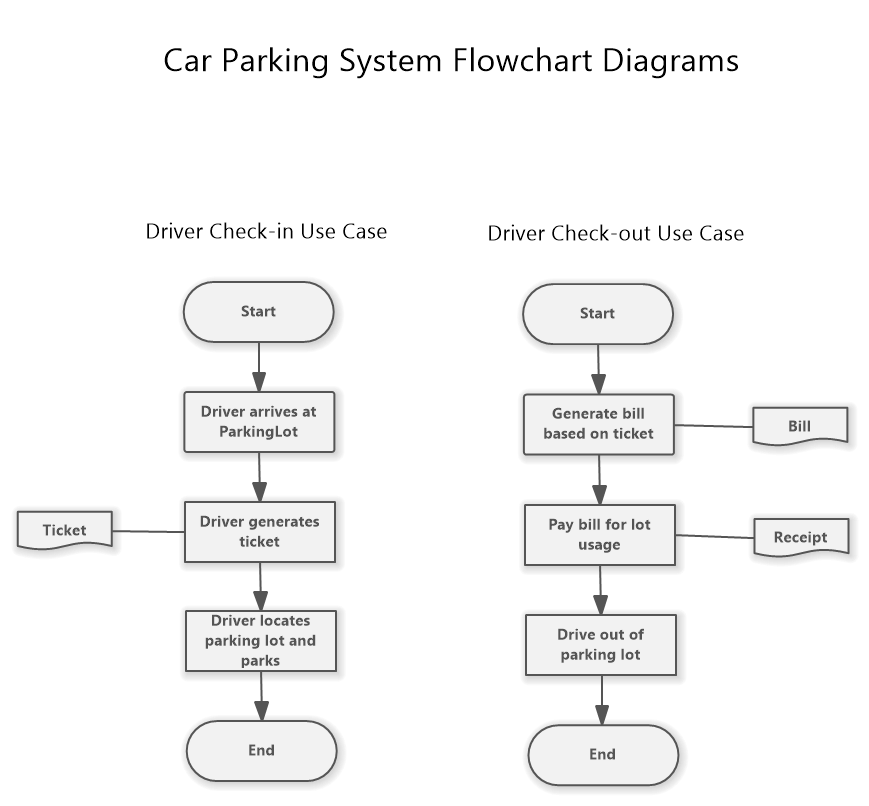
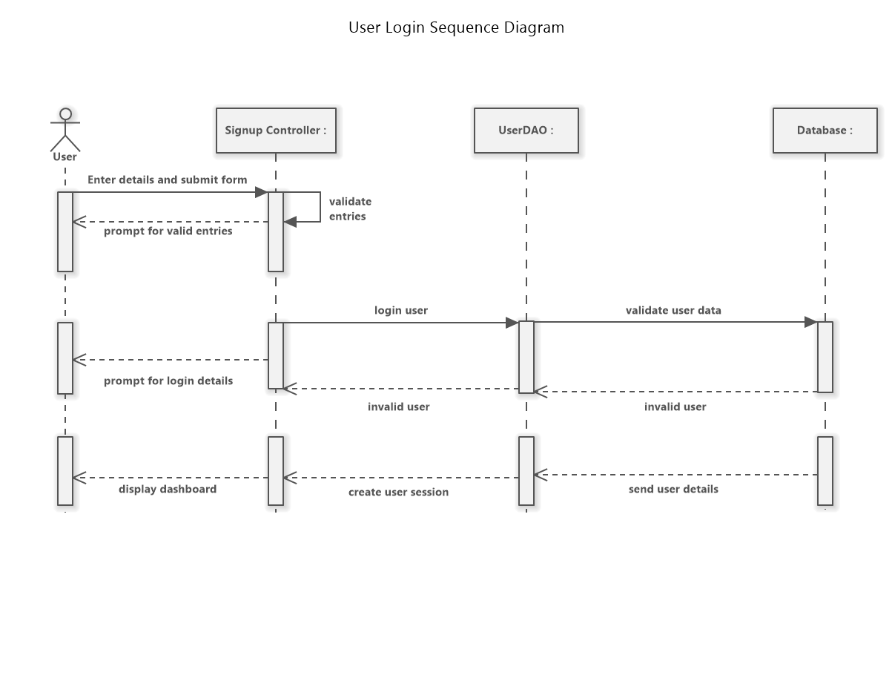
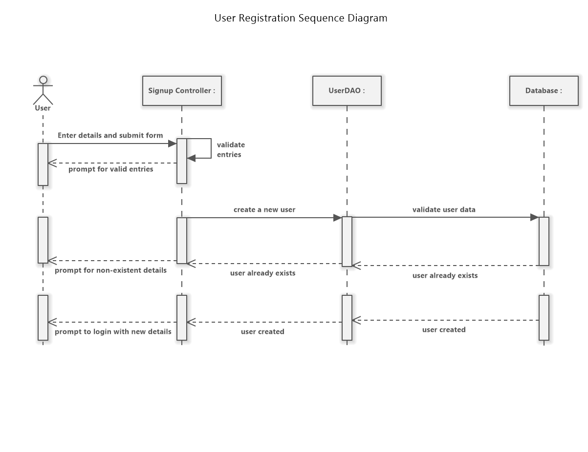

# Car Parking Management System

## Overview
The **Car Parking Management System** is an individual Java application project developed to demonstrate the practical application of Java and Spring Boot concepts, object-oriented programming principles, and software engineering best practices.

The system is designed to efficiently manage parking operations by simplifying parking slot booking, vehicle check-in/check-out, billing management, and parking status monitoring. It aims to provide a well-organized and user-friendly parking experience for both administrators and vehicle owners.


# Features

The application includes the following core features:

- **Parking Slot Booking** – Users can reserve available parking slots for their vehicles.
- **Vehicle Check-in / Check-out** – Tracks vehicle entry and exit for efficient space allocation.
- **Billing System** – Calculates parking fees based on parking duration.
- **Parking Slot Status Display** – Displays parking slot availability in real time.
- **Unique Ticket Generation** – Generates a unique ticket ID for every vehicle check-in.
- **User Authentication & Authorization** – Supports secure login and role-based access control.
- **Reporting & Analytics** – Generates parking usage and billing reports.


# A Quick Walkthrough Video
This short video provides a quick walkthrough of the project for those who prefer not to read a long text. 

## 🎥 Project Demo Video

[](https://drive.google.com/file/d/1Qb4QmupXRD4hTzJZ8SlnoN01ZeEI6zYD/view?usp=sharing)


# System Design

## Use Case Diagram




## Class Diagram




## Entity Relationship Diagram (ERD)




## Activity Diagram




## Sequence Diagram – Login Process




## Sequence Diagram – Parking Booking Process




# Technologies & Concepts Used

## Languages & Frameworks
- Java
- Spring Boot
- Maven
- JavaFX

## Development Concepts
- Object-Oriented Programming (OOP)
- Object-Oriented Design (OOD)
- SOLID Principles

## Database / Storage
- SQLite Database
- File System Repository

## Development Tools
- Eclipse IDE
- IntelliJ IDEA
- NetBeans


# Functional Requirements

## 1. User Management
- Users should be able to register and log in securely.
- User inputs should be validated before storage.
- Admin users should be able to manage parking slots and generate reports.

## 2. Parking Slot Booking
- Users should be able to view available parking slots.
- Users should be able to select and reserve parking slots.
- Slot availability should update in real time after booking.

## 3. Vehicle Check-in & Check-out
- Users should be able to check in vehicles upon arrival.
- The system should generate a unique ticket ID for each check-in.
- Users should be able to check out vehicles when leaving.
- Parking slot status should update automatically after check-out.

## 4. Billing System
- The system should calculate parking fees based on duration.
- Users should be able to review billing details before payment.
- The system should generate receipts for completed transactions.

## 5. Parking Slot Status Display
- Parking slot availability should be displayed in real time.
- Slot status should update dynamically as vehicles enter and leave.

## 6. Reporting & Analytics
- Generate parking slot usage reports.
- Generate billing reports containing parking duration and fee details.


# Non-Functional Requirements

## Performance
- System responses should occur within 2 seconds.
- The system should support at least 20 concurrent parking transactions.

## Scalability
- The system should support expansion to multiple parking locations.
- The architecture should allow future integrations such as online payments.

## Usability
- The interface should be simple and easy to navigate.
- The system should provide a rich and user-friendly experience.

## Security
- Password hashing and secure authentication should be implemented.
- Role-based access control should restrict admin features.
- User data and transactions should be securely stored.

## Reliability & Availability
- The system should be available 24/7 with minimal downtime.
- Data integrity should be maintained at all times.


# System Requirements

## Software Requirements
- Java Development Kit (JDK 11 or later)
- Any Java-supported IDE:
  - Eclipse
  - IntelliJ IDEA
  - NetBeans
- JavaFX

### JavaFX Setup Reference
https://coderslegacy.com/java/introduction-to-javafx/

## Hardware Requirements
- Minimum 4GB RAM
- Minimum 500MB Storage Space
- Windows / Linux / macOS


# Sample Menu

```text
1. View Parking Slots
2. Book Parking Slot
3. Check Out Vehicle
4. Billing
5. Exit
```


# Sample Parking Status Report

```text
Status Report

-----------------------------------------------------------
Slot ID | License Plate No | Status   | Check-in | Check-out
-----------------------------------------------------------
1       | XOR247           | Vacant   | 08:30 AM | 09:45 AM
2       | ALPHA123         | Occupied | 02:45 PM | -
3       | DXL823           | Occupied | 11:35 AM | -
-----------------------------------------------------------
```


# Sample Billing Report

```text
Billing Report

----------------------------------------------------------------------------
Ticket ID | License Plate | Check-in | Check-out | Duration | Total Fee
----------------------------------------------------------------------------
045       | XOR247        | 08:30 AM | 09:45 AM  | 75 mins  | CAD$3.75
087       | TAN007        | 10:50 AM | 11:10 AM  | 20 mins  | CAD$1.00
----------------------------------------------------------------------------
```


# Project Goals

The main goals of this project are to:

- Demonstrate proficiency in Java application development.
- Apply Spring Boot concepts in a real-world project.
- Practice software engineering principles such as SOLID and OOP.
- Build a scalable and maintainable parking management solution.
- Improve user experience through efficient parking operations.


# Future Improvements

Potential future enhancements include:

- Online payment gateway integration
- QR code-based ticket generation
- Mobile application support
- Cloud database integration
- Multi-location parking support
- Real-time notifications and alerts
- Vehicle history tracking


# Author

Developed by Paul Akinpelu as an individual Java/Spring Boot learning project focused on applying software engineering principles and building practical management solutions.
